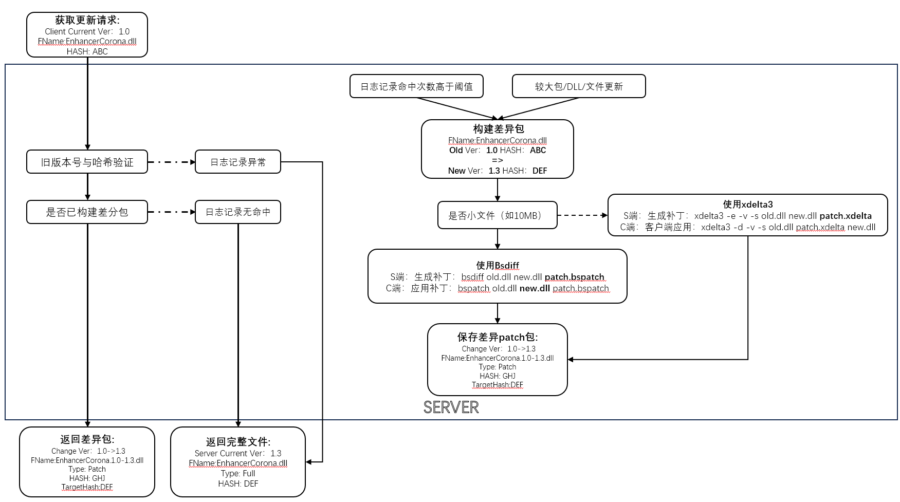

# Ra3.BattleNet.Updater

文件增量更新器

## 参考

- https://github.com/RA3BattleNet/Metadata
- https://github.com/RA3BattleNet/Metadata/blob/csharp-linq/Metadata/apps/ra3battlenet/manifests/1.5.2.0.xml
- https://github.com/sisong/HDiffPatch

## 差异patch工具性能测试

|filename|SIZE|bsdiff|deltaq(bsdiff)|xdelta3|hdiffpatch|
|:-:|:-:|:-:|:-:|:-:|:-:|
|EnhancerCorona.old.dll -> EnhancerCorona.new.dll|3.3M -> 3.3M|**483K**|**483K**|576K~632K|921K|
|ubuntu-20.04.2-live-server-amd64.iso -> ubuntu-20.04.3-live-server-amd64.iso|1.2G -> 1.2G|耗时过长|耗时过长|1.1G|**695M**|
|amdvlk32.dll -> amdvlk64.dll|102M -> 115M|**23M**|**23M**|24M|63M|

**结论：**

小文件：bsdiff

大文件：hdiffpatch

## 初步设计框架

## 详细结构设计

### 程序功能模块

#### 服务端

输入：旧版本manifest.xml
功能：解析旧版本manifest和新版本对比（更新版本需要其他程序），对相关文件进行处理、标记、汇总，输出新的manifest.xml，并将整体打包
输出：打包的patch（包含新manifest.xml，解析规则，和所有对应的文件）

#### 客户端

先前准备：上传本地manifest.xml至服务端（manifest.xml）
输入：服务器打包的patch文件
功能：根据patch内的文件与更新规则更新本地
输出：None

### XML输入格式（v1）

此文件应该作为类数据库作用，如果客户端消失或出现问题，会无视并重置此文件（此情况无法使用Patch，只能使用新文件，需要下载完整包）

> 注意：文件自身需要保证是UTF-8 LF，否则会由于MD5校验问题会被视为问题文件。

- TAG标记
  - UUID(暂无作用，后续可做随机种)
  - xml生成时间
  - commit信息（不会影响程序，仅用于标记）
- 文件列表
  - 文件夹(*可重复)
  - 文件(*可重复)

#### Metadata

Attribute["Version"]="1.2.3"

|manifest.xml版本|说明|类型|
|:-:|:-:|:-:|
|Version(1,2,3)|更新列表版本|Version|

##### UUID

|UUID|说明|类型|
|:-:|:-:|:-:|
|Guid.NewGuid().ToString("N");|标准32位数字UUID格式|string|

##### GenTime

|xml生成时间|说明|类型|
|:-:|:-:|:-:|
|DateTimeOffset.Now.ToUnixTimeSeconds()|运行计算机上距离1970-01-01 00:00:00 UTC到现在的秒数|long|

##### Commit

任意信息即可，不会影响程序

#### Includes

暂无作用

#### Manifest

##### Folder（计划，暂无支持）

|xml node名|说明|例|是否必须|可选值(类型)|代码例|
|:-:|:-:|:-:|:-:|:-:|:-:|
|FolderName|文件夹名|content|T|String|-|
|Path|相对路径|/|T|String|-|
|Recursion|是否递归包括文件夹内部所有文件和文件夹|True|T|Boolen|-|
|Type|递归文件类型|0|F|0:Bin,1:Text|Byte|-|
|Mode|递归程序处理模式|0|F|0:Auto,1:Force,2:Skip|Byte|-|

##### File

|xml node名|说明|例|是否必须|可选值(类型)|代码例|
|:-:|:-:|:-:|:-:|:-:|:-:|
|UUID|文件唯一特征符（不随文件哈希）|
|FileName|文件名|NativeDll.dll|T|String|-|
|MD5|文件特征值|1acb9f0629e33725c11e0c072c431a73|T|String|-|
|Path|相对路径|/contents/|T|String|-|
|Version|文件版本|1.2.3|T|Version|new Version(1,2,3)|
|Type|文件类型|0|F|0:Bin,1:Text|Byte|-|
|Mode|程序处理模式|0|F|0:Auto,1:Force,2:Skip|Byte|-|

- 说明：
  - 相对路径以此xml文件为根，类似.git，无法包括父目录内容
  - 文件类型改为（Text）暂时无实际作用，后续考虑Text的文件通过git的模式更新，现在均以二进制文件(bin)处理。
  - 程序处理模式解释：
    - Force：强制使用patch，不比对文件大小
    - Skip：不使用patch，直接使用原文件

### example文件目录测试例

此目录作为测试例，用于测试文件更新，包含状况：文件更新，文件删除，新增文件

|MD5|文件路径|
|:-:|:-:|
|808f0febad563484e73a78411c1d90b9|./example/new/git_version|
|ca96a24439a42b1067d864b9bc693a85|./example/new/Lyi.dll|
|b95dbde252cc8ea490e1d9d04ec5fe0d|./example/new/tools/aria2c.exe|
|2db41309c9eadae1ef568f8a649289d0|./example/new/tools/EnhancerCorona.dll|
|1c602e80d41ed740d320d0a18b87b9aa|./example/new/tools/RA3LuaBridge.dll|
|-|-|
|fb2b21b2238d6be4bbd687ef9626cca1|./example/old/git_version|
|ca96a24439a42b1067d864b9bc693a85|./example/old/Lyi.dll|
|b95dbde252cc8ea490e1d9d04ec5fe0d|./example/old/tools/aria2c.exe|
|1327dbda98a5f18d779154c9c7549358|./example/old/tools/EnhancerCorona.dll|
|f07deca971d5e53bd6e4b65071907b50|./example/old/tools/RA3LuaBridge.dll|
|94248a26fb0bae39a513e4bddc2f092e|./example/old/CrazyEditor.dll|